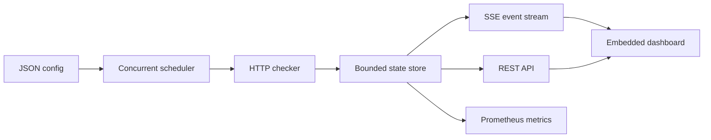

# BeaconBoard

[](https://github.com/Xiviam/beaconboard/actions/workflows/ci.yml)
[](https://go.dev/)
[](LICENSE)

BeaconBoard is a small, self-hosted uptime monitor built entirely with the Go standard
library. It checks HTTP endpoints concurrently, keeps bounded in-memory history, streams
live results to an embedded dashboard, and exposes Prometheus-compatible metrics.

No Node.js build, JavaScript framework, database, or runtime Go dependency is required.

## Highlights

- One lightweight goroutine per target with non-overlapping checks.
- Per-target method, interval, timeout, expected status, and request headers.
- Responsive dashboard embedded into the binary with live SSE updates.
- Read-only REST API and bounded check history.
- Prometheus-compatible `/metrics` endpoint.
- Strict JSON configuration with safe defaults and fail-fast validation.
- Graceful `SIGINT`/`SIGTERM` shutdown.
- Static, non-root `scratch` container with a built-in health check.
- Race-detector tests and hardened Docker smoke test in GitHub Actions.

## Quick start

Requirements: Go 1.23 or newer.

```bash
cp config.example.json beaconboard.json
go run ./cmd/beaconboard -config beaconboard.json
```

Open [http://localhost:8080](http://localhost:8080). The first checks run immediately.

With Docker Compose:

```bash
docker compose up --build
```

## Configuration

```json
{
  "listen": ":8080",
  "history_limit": 120,
  "targets": [
    {
      "id": "production-api",
      "name": "Production API",
      "url": "https://example.com/healthz",
      "method": "GET",
      "interval": "30s",
      "timeout": "5s",
      "expected_status": 200,
      "headers": {
        "Accept": "application/json"
      }
    }
  ]
}
```

`id` values must be unique. Only absolute `http` and `https` URLs are accepted. URL
credentials, fragments, hop-by-hop headers, header newlines, unknown JSON fields, and
timeouts longer than their interval are rejected at startup. Header values are never
returned by the API or metrics endpoint.

The config path defaults to `beaconboard.json` and can be changed with `-config` or
`BEACONBOARD_CONFIG`. `-listen` or `BEACONBOARD_LISTEN` overrides the configured address.
The built-in `healthcheck` command reads the same config, so container health checks follow
a customized internal listen port. `BEACONBOARD_HEALTH_URL` can override its probe URL.

## HTTP interface

| Endpoint | Purpose |
| --- | --- |
| `GET /` | Embedded live dashboard |
| `GET /healthz` | Process health check |
| `GET /api/v1/monitors` | Current state of every target |
| `GET /api/v1/monitors/{id}` | Target policy and rolling history |
| `GET /api/v1/events` | Server-Sent Events stream |
| `GET /metrics` | Prometheus text exposition |

The event stream starts with a `snapshot` event and then streams completed probes as
`check` events. It also sends heartbeat comments every 15 seconds. Slow clients are
disconnected instead of blocking checks; EventSource reconnects and receives a fresh
snapshot.

```bash
curl http://localhost:8080/api/v1/monitors
curl -N http://localhost:8080/api/v1/events
curl http://localhost:8080/metrics
```

## Architecture



The configuration is immutable after startup. That keeps the public API read-only and
avoids turning the service into an unauthenticated SSRF endpoint. State is intentionally
in memory: BeaconBoard is designed for a single small deployment where a restart may
discard historical samples.

## Container hardening

The image contains only the static binary and CA certificates and runs as UID/GID 65532.
For a manual hardened run:

```bash
docker build -t beaconboard .
docker run --rm \
  --read-only \
  --cap-drop=ALL \
  --security-opt=no-new-privileges \
  -v "$PWD/config.example.json:/etc/beaconboard/config.json:ro" \
  -p 8080:8080 \
  beaconboard
```

For internet-facing deployments, place BeaconBoard behind a TLS reverse proxy and add
authentication if the monitored endpoint names or URLs are sensitive.

## Development

```bash
go test ./...
go test -race -shuffle=on ./...
go vet ./...
go build ./cmd/beaconboard
```

The CI workflow runs formatting checks, module verification, vet, race-detector tests on
the minimum and current stable Go versions, a static build, and a hardened container smoke
test.

## License

[MIT](LICENSE)
